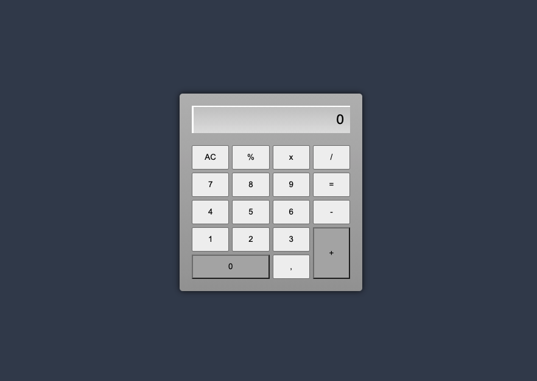

<div align="center">
  <h1>Calculadora JavaScript</h1>
  <p>Aplicação desenvolvida com HTML, CSS e a linguagem JavaScript pura, com intuito de estudos sobre logica de programação.</p>
  
</div>

# 📒 Índice
* [Descrição](#descrição)
* [Tecnologias](#tecnologias)
* [Design](#design)
  * [Cores](#cores)
  * [Fontes](#fontes)
* [Instalação](#instalação)
* [Licença](#licença)

# 📃 <span id="descrição">Descrição</span>
Aplicação desenvolvida com HTML, CSS e a linguagem JavaScript pura, com intuito de estudos sobre logica de programação.

# 💻 <span id="tecnologias">Tecnologias</span>
- **HTML**
- **CSS**
- **JavaScript**

# 🎨 <span id="design">Design</span>
- O modelo final para desktop está disponível na pasta `./design`

- <span id="cores">Cores<br></span>
  * #364253<br>
  * #b7b7b7<br>
  * #9c9c9c<br>
  * #c5c5c5<br>
  * #e0e0e0<br>
  * #adadad<br>
  * #fff<br>
  * #000<br>

- <span id="fontes">Fontes<br></span>
  * Arial, Helvetica, sans-serif

# 🚀 <span id="instalação">Instalação</span>
```bash
  # Clone este repositório:
  $ git clone https://github.com/CleilsonAndrade/Calculadora_JavaScript.git
  $ cd ./Calculadora_JavaScript
```
# 📝 <span id="licença">Licença</span>
Esse projeto está sob a licença MIT. Veja o arquivo [LICENSE](LICENSE) para mais detalhes.

---

<p align="center">
  Feito com 💜 by CleilsonAndrade
</p>